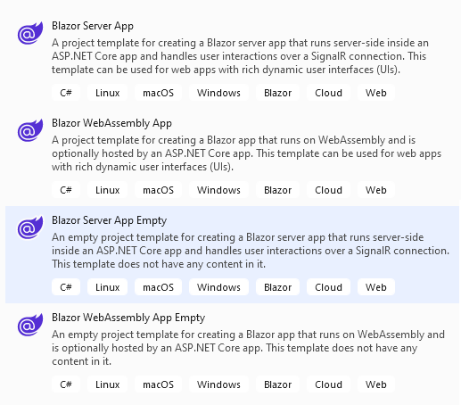

# blazor-from-template
Blazor project generated from the Visual Studio 2022 templates (version 17.6.4)



- BlazorApp1 is using the **Blazor Server App** template
> A project template for creating a Blazor server app that runs server-side inside an ASP.NET Core app and handles user interactions over a SignalR connection. This template can be used for web apps with rich dynamic user interfaces (UIs).

- BlazorApp2 is using the **Blazor WebAssembly App** template
> A project template for creating a Blazor app that runs on WebAssembly and is optionally hosted by an ASP.NET Core app. This template can be used for web apps with rich dynamic user interfaces (UIs).

# Notes : BlazorApp1

## Program.cs
```csharp
using BlazorApp1.Data;
using Microsoft.AspNetCore.Components;
using Microsoft.AspNetCore.Components.Web;

namespace BlazorApp1
{
    public class Program
    {
        public static void Main(string[] args)
        {
            var builder = WebApplication.CreateBuilder(args);

            // Add services to the container.
            builder.Services.AddRazorPages();
            builder.Services.AddServerSideBlazor();
            builder.Services.AddSingleton<WeatherForecastService>();

            var app = builder.Build();

            // Configure the HTTP request pipeline.
            if (!app.Environment.IsDevelopment())
            {
                app.UseExceptionHandler("/Error");
                // The default HSTS value is 30 days. You may want to change this for production scenarios, see https://aka.ms/aspnetcore-hsts.
                app.UseHsts();
            }

            app.UseHttpsRedirection();

            app.UseStaticFiles();

            app.UseRouting();

            app.MapBlazorHub();
            app.MapFallbackToPage("/_Host");

            app.Run();
        }
    }
}
```
- Entry point into application
- Namespace [Microsoft.AspNetCore.Components](https://learn.microsoft.com/en-us/dotnet/api/microsoft.aspnetcore.components?view=aspnetcore-7.0) - implementation of components, their rendering, event handling, and routing. Specificially, it defines [IComponent](https://learn.microsoft.com/en-us/dotnet/api/microsoft.aspnetcore.components.icomponent?view=aspnetcore-7.0) and [ComponentBase](https://learn.microsoft.com/en-us/dotnet/api/microsoft.aspnetcore.components.componentbase?view=aspnetcore-7.0).
    - [IComponent.cs](https://github.com/dotnet/aspnetcore/blob/main/src/Components/Components/src/IComponent.cs)
    - [ComponentBase.cs](https://github.com/dotnet/aspnetcore/blob/main/src/Components/Components/src/ComponentBase.cs)
- Namespace [Microsoft.AspNetCore.Components.Web](https://learn.microsoft.com/en-us/dotnet/api/microsoft.aspnetcore.components.web?view=aspnetcore-7.0) - Contains types for supplying information about browser events to the Blazor framework.

- Class [WebApplication](https://learn.microsoft.com/en-us/dotnet/api/microsoft.aspnetcore.builder.webapplication?view=aspnetcore-7.0) - a web application used to configure the HTTP pipeline and routes
    - [WebApplication.cs](https://github.com/dotnet/aspnetcore/blob/main/src/DefaultBuilder/src/WebApplication.cs)
- Method [AddRazorPages](https://learn.microsoft.com/en-us/dotnet/api/microsoft.extensions.dependencyinjection.mvcservicecollectionextensions.addrazorpages?view=aspnetcore-7.0) - adds services for pages to the specified IServiceCollection. This method configures the MVC services for the commonly used features for pages. This combines the effects of AddMvcCore(IServiceCollection), AddAuthorization(IMvcCoreBuilder), AddDataAnnotations(IMvcCoreBuilder), AddCacheTagHelper(IMvcCoreBuilder), and AddRazorPages(IMvcCoreBuilder).
